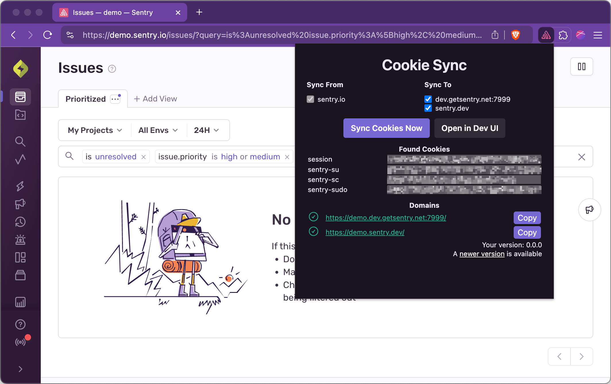

# Sentry.io Cookie Sync

A browser plugin to automatically sync cookies for local frontend development of sentry.io. This extension will copy cookies from sentry.io and make them available for your development environment, including version sandbox deployments.



## 🚀 Installation

You can install the latest version of the Cookie Sync extension using the links below:

- [Get Cookie Sync for Chrome](https://chrome.google.com/webstore/detail/sentry-cookie-sync/kchlmkcdfohlmobgojmipoppgpedhijh)
- [Get Cookie Sync for Firefox](https://addons.mozilla.org/en-US/firefox/addon/sentry-cookie-sync/)

This is the recommended installation method.

## 🔧 Manual Installation

You can download the bundled extension for your browser from the github releases page [here](https://github.com/getsentry/cookie-sync/releases).

_NOTE: Auto-update will not work with manual installations._

- ### Chromium Based Browsers (Chrome, Edge, Opera)

    1. Visit: [chrome://extensions](chrome://extensions) or [edge://extensions](edge://extensions) or [about://extensions](about://extensions) (in opera).
    2. Enable `Developer Mode`
        - Chrome/Opera: The toggle button is in the top-right corner 
        - Edge: The toggle button is in the left sidebar
        - Refresh the page!
    3. Drag & drop the `.zip` file you downloaded into the page.

- ### Firefox

    1. Get an [ESR](https://www.mozilla.org/en-US/firefox/enterprise/), [Developer](https://www.mozilla.org/en-US/firefox/developer/), or [Nightly build](https://www.mozilla.org/en-US/firefox/channel/desktop/#nightly) of firefox.
    2. Follow Mozilla's instructions to enable installing unsigned addons [here](https://support.mozilla.org/en-US/kb/add-on-signing-in-firefox#w_what-are-my-options-if-i-want-to-use-an-unsigned-add-on-advanced-users).
      - Visit [about:config](about:config)
      - Set `xpinstall.signatures.required = false`
      - Set `extensions.langpacks.signatures.required = false`
    3. Visit [about:addons](about:addons)
    4. Drag & drop the `firefox.crx` file you downloaded into the page.

## 🐛 Bugs

Please file an issue [here](https://github.com/getsentry/cookie-sync/issues) for feature requests, bugs, missing documentation, or unexpected behavior.

## 🖥️ Developing

Ensure you have:

- [Node.js](https://nodejs.org) 14 or later installed
- [Yarn](https://yarnpkg.com) v1 or v2 installed

Then run the following:

- `yarn install` to install dependencies.
- `yarn run dev:chrome` to start the development server for chrome extension
- `yarn run dev:firefox` to start the development server for firefox addon
- `yarn run build:chrome` to build chrome extension
- `yarn run build:firefox` to build firefox addon
- `yarn run build` builds and packs extensions all at once to `extension/` directory

### Test in Dev Mode

1. `yarn install` to install dependencies.
2. `yarn run dev:chrome` or `yarn run dev:firefox` To watch file changes in development
3. Load the extension in your browser

    _NOTE: Remove any existing versions first_

    #### Chrome

    - Go to the browser address bar and type `chrome://extensions`.
    - Check the `Developer Mode` button to enable it.
    - Click on the `Load Unpacked Extension…` button.
    - Select the folder `cookie-sync/extension/chrome`.

    #### Firefox [ESR](https://www.mozilla.org/en-US/firefox/enterprise/), [Developer](https://www.mozilla.org/en-US/firefox/developer/), or [Nightly build](https://www.mozilla.org/en-US/firefox/channel/desktop/#nightly)

    - Go to the browser address bar and type `about:debugging#/runtime/this-firefox`.
    - Click on the `Temporary Extensions` Section, then the `Load Unpacked Extension…` button.
    - Select the file `cookie-sync/extension/firefox.xpi`.

### Test Prod builds

- `yarn run build` builds the extension for all the browsers.

Note: By default the `package.json` and `manifest.json` are set with version `0.0.0`. The CI pipeline will set the version before building the bundles.

### Generating browser specific manifest.json

Update `source/manifest.json` file with browser vendor prefixed manifest keys

```js
{
  "__chrome__name": "SuperChrome",
  "__firefox__name": "SuperFox",
  "__edge__name": "SuperEdge",
  "__opera__name": "SuperOpera"
}
```

if the vendor is `chrome` this compiles to:

```js
{
  "name": "SuperChrome",
}
```

Add keys to multiple vendors by separating them with | in the prefix

```
{
  __chrome|opera__name: "SuperBlink"
}
```

if the vendor is `chrome` or `opera`, this compiles to:

```
{
  "name": "SuperBlink"
}
```

See the original [README](https://github.com/abhijithvijayan/wext-manifest-loader) of `wext-manifest-loader` package for more details

## Publishing

New versions will be automatically published into the Chrome and Firefox Extension/Addon stores via the Github Actions CI pipeline.

To modify the content of the store pages, you will need access to the respective accounts.

Chrome Store Page:

1. Using your @sentry.io account, become a member of the `role-deploy-sentry-browser-extension` google group
2. Visit https://chrome.google.com/webstore/devconsole and [Register as a Chrome Web Store developer](https://developer.chrome.com/docs/webstore/register/).
3. Access the [listing](https://chrome.google.com/webstore/devconsole/d1e3adb2-fbbf-437c-bbbe-e3c0a9d34cfe/kchlmkcdfohlmobgojmipoppgpedhijh/edit/listing) in the "sentry.io" publisher.

Firefox Addon Page:

1. Using 1Password access the "Mozilla Extension Publisher: cookie-sync@sentry.io" credentials
2. Visit the Firefox Addon Store here: https://addons.mozilla.org/en-US/developers/addon/sentry-cookie-sync/edit

## License

[MIT ©](https://github.com/getsentry/cookie-sync/blob/main/LICENCE)
